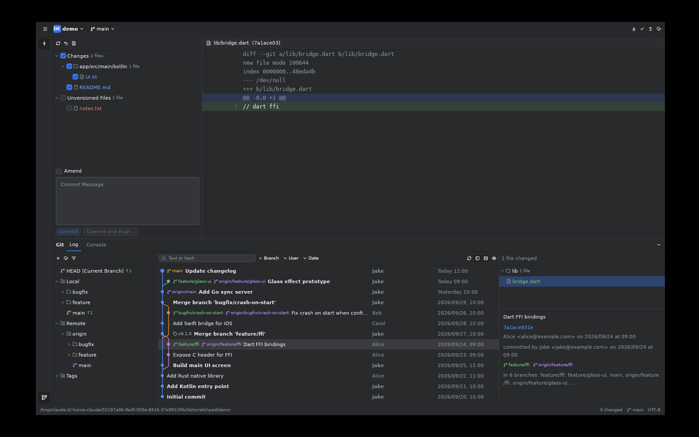

# Junction Studio

Junction Studio — Git & Code Navigator：桌面客户端，一比一复刻 Android Studio / IntelliJ 的 Git 功能，以及跨语言的代码索引和跳转（JNI、Dart FFI、Rust extern C、Swift/ObjC 桥接）。
技术栈：Rust + [GPUI](https://www.gpui.rs) + [GPUI Kit / gpui-component](https://github.com/longbridge/gpui-kit)。
Git 操作和 IntelliJ 的 git4idea 一样，直接调用 `git` 命令行。



## 运行

需要 Rust 1.90+ 和 `git`。

```sh
cargo run --release -- /path/to/repo     # 不传路径时打开当前目录
JUNCTION_THEME=light cargo run           # 亮色主题
```

- **Windows**：需要 Visual Studio Build Tools（MSVC）。Windows 11 上窗口使用 Mica 背景。
- **macOS**：需要 Xcode Command Line Tools。
- **Linux**：先安装依赖：`sudo apt install libxkbcommon-x11-dev libwayland-dev libx11-xcb-dev libvulkan1 libfontconfig-dev libssl-dev`。

## 功能清单

完整对照表和进度见 [docs/FEATURES.md](docs/FEATURES.md)（M1–M6 阶段）。

## 结构

```
src/git/        git 后端：命令执行与 Console 记录、log 解析、提交图布局、refs、status/commit
src/model.rs    仓库状态（后台加载、选中提交、操作 + 通知）
src/ui/         界面：workspace（主窗口）、log_view、commit_view、branches_popup、diff_view、dialogs
src/theme.rs    IntelliJ Int UI 亮/暗配色，半透明面板
```

`cargo test` 运行解析器、提交图布局和文件树的单元测试。
